# Matfiles
  Matugen powered dotfiles for linux.

___

### Stuff that i use :
 > + **Window Manager**    =>   Hyprland, Niri, Mangowc and Qtile  
 > + **Terminal**          =>   Alacritty (opaque), Kitty (transparent)  
 > + **Powermenu**         =>   wlogout(with Hyprland), Fuzzel (with Niri and Mangowc)  
 > + **App Launcher**      =>   Rofi-wayland, Fuzzel, nwg-drawer  
 > + **Bars/Panel**        =>   Waybar(on Hyprland), EWW powered panel(with Niri), Qtile's bar(on qtile)  
 > + **Theming stuff**     =>   Matugen (yeah nice one genius!!)  
 > + **Screenshot stuff**  =>   Hyprshot(integrated into a rofi script)  
 >>> ‼️ you would want to have <mark>adw-gtk-theme</mark> in order to get gtk colors working

___

### **<mark>FAQ</mark>**  
I want to make my own themes :  
The answer is <mark>yess!!</mark> you absolutely can  
> 1. just create a folder at .config/themes/your_theme_name e.g. catppuccin  
> 1. place a hyprtheme.conf file inside theme folder along with wallpaper folder  
> 1. what to put in wallpaper folder duh!! figure it out 🌝

## Screenshots
 > + Here is how it looks
      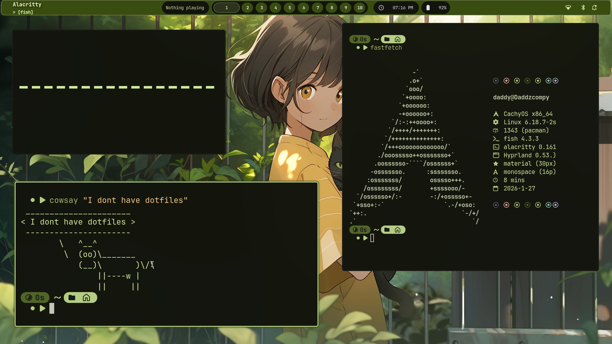
 > + swaync 
      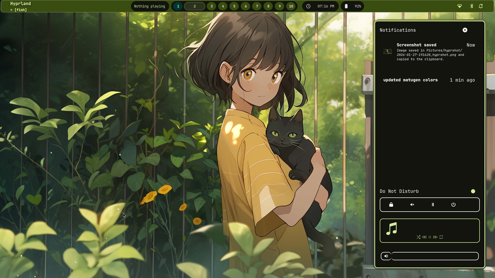
 > + Auto-recoloring screenshot menu
    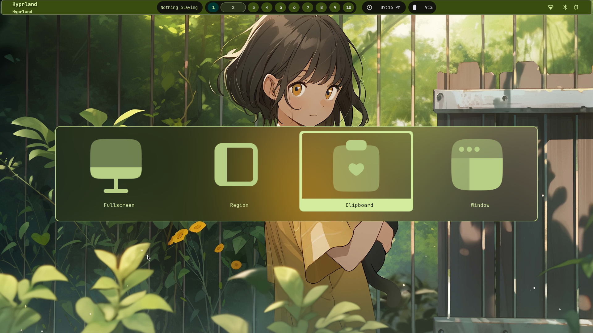
 > + wallpaper switcher (rofi-based)
    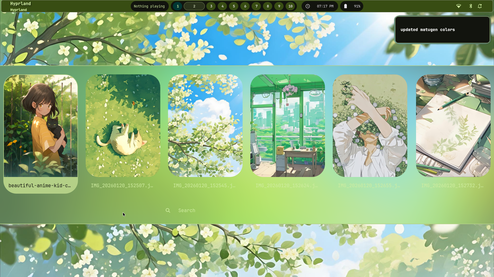
    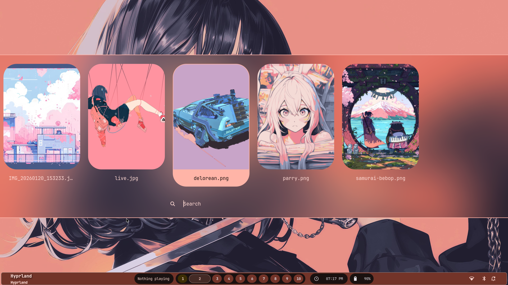
 > + Theme switcher (yes its rofi based too)
    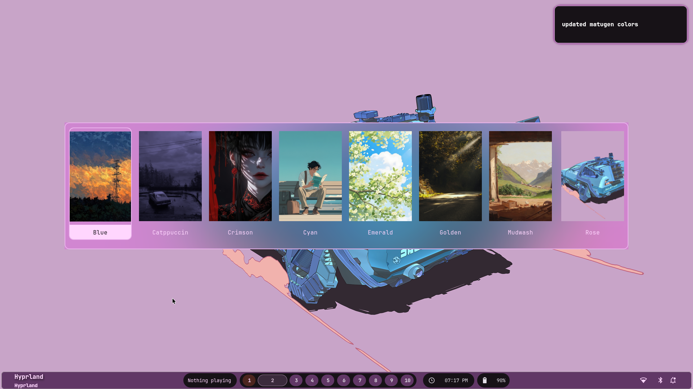
 > + Zed recolor using Matugen
 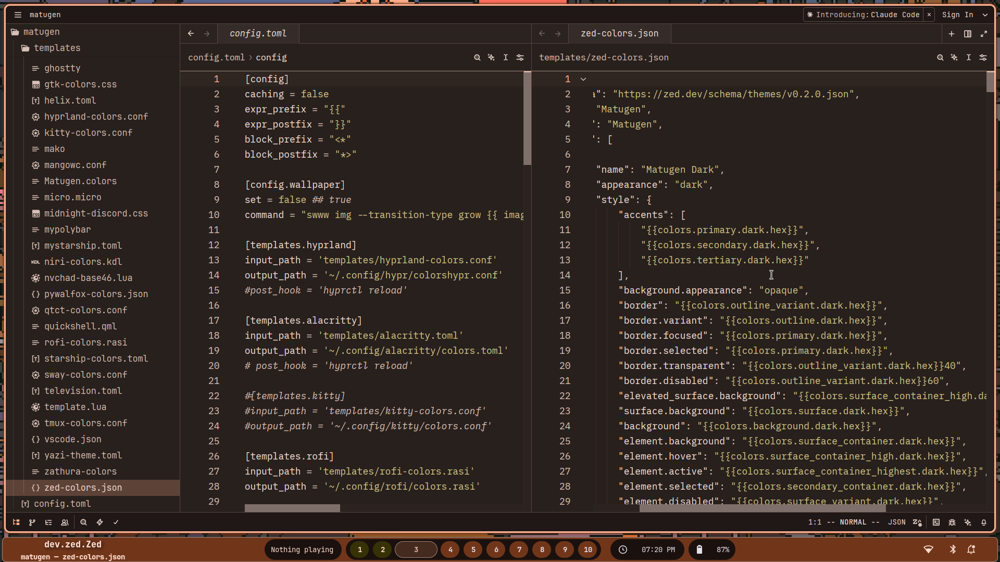
  > + Rofi App Launcher and windows themed Waybar
 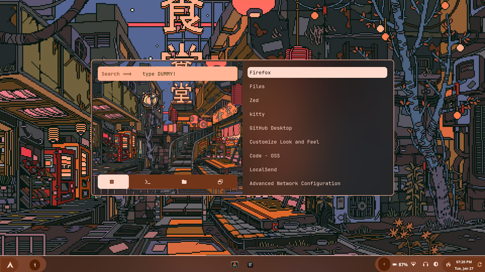
  > + Waybar theme switcher
 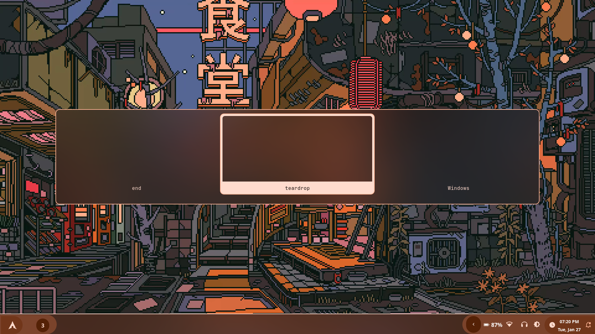
  > + Material Nvim (starter with matugen colors)
  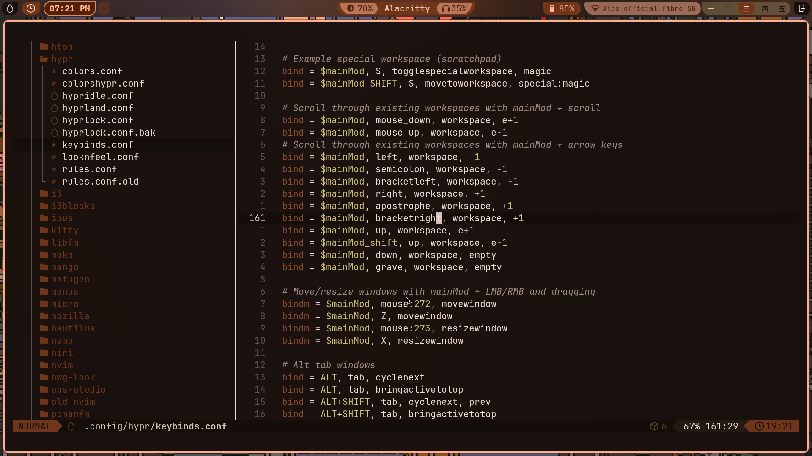
  > + Old goth-cornered eww for Niri
  
  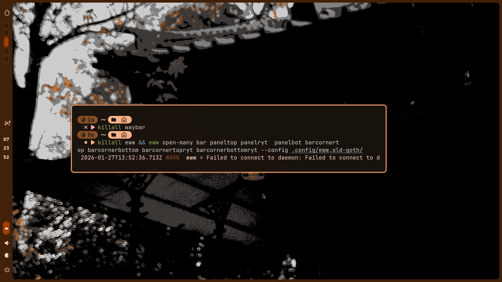
